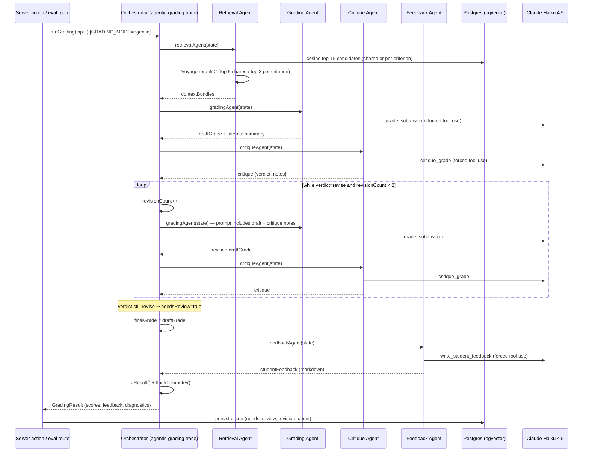

# Agentic Grading Pipeline — Overview

Documentation of the multi-agent grading pipeline **as implemented** in
`src/lib/agents/`. Where the code and `docs/plans/AI_Grader_Multi_Agent_Plan.md`
disagree, the discrepancy is flagged (here and in each agent doc) rather than
resolved.

Per-agent docs:

- [retrieval.md](retrieval.md) — Retrieval Agent
- [grading.md](grading.md) — Grading Agent
- [critique.md](critique.md) — Critique Agent
- [feedback.md](feedback.md) — Feedback Agent

## Entry point and mode flags

`runGrading()` in `src/lib/grading/index.ts` dispatches on **GRADING_MODE**:

| Flag | Values | Default | Effect |
| --- | --- | --- | --- |
| `GRADING_MODE` | `single` \| `agentic` | `single` | `single` runs the one-call control (`src/lib/grading/single.ts`) — the A/B control, never modified. `agentic` runs `gradeSubmissionAgentic()` (`src/lib/agents/orchestrator.ts`). |
| `RETRIEVAL_MODE` | `shared` \| `per_criterion` | `shared` | Independent A/B flag read by the Retrieval Agent (`getRetrievalMode()` in `src/lib/agents/retrieval.ts`). Any value other than `per_criterion` falls back to `shared`. |

Callers can also override the mode per call via `runGrading(input, mode)` —
used by the eval route (`src/app/api/eval/grade/route.ts`) to run both modes
without restarting.

## Shared state

All agents implement `AgentFn = (state: GradingState) => Promise<Partial<GradingState>>`
(`src/lib/agents/state.ts`) and return only the fields they update. The
orchestrator merges each patch with spread. Key fields:

| Field | Written by | Read by |
| --- | --- | --- |
| `submissionId`, `courseId`, `assignmentTitle`, `assignmentContent`, `submissionText`, `rubric` | `initState()` | all agents |
| `contextBundles` | Retrieval Agent | Grading, Critique |
| `draftGrade` | Grading Agent | Critique, orchestrator |
| `critique` | Critique Agent | orchestrator, Grading (revision prompt) |
| `revisionCount` | orchestrator | Grading (via span summary), `toResult()` |
| `finalGrade` | orchestrator (copies `draftGrade`) | Feedback, `toResult()` |
| `studentFeedback` | Grading Agent (internal summary), then overwritten by Feedback Agent | `toResult()` |

## Orchestrator flow (`src/lib/agents/orchestrator.ts`)

1. `initState(input)` — fresh state from `RunGradingInput`.
2. **Retrieval Agent** → `contextBundles`.
3. **Grading Agent** → `draftGrade` + internal `studentFeedback`.
4. **Critique Agent** → `critique` (`accept` | `revise`).
5. **Revision loop**: while `critique.verdict === "revise"` and
   `revisionCount < MAX_REVISIONS` (**2**): increment `revisionCount`,
   re-run Grading (its prompt now embeds the prior draft and critique notes),
   re-run Critique. So at most 3 grading passes / 3 critique passes total.
   `revisionCount` counts **re-grades only** (0 = accepted first try).
6. **needs_review**: if the loop exits with the verdict still `revise`
   (cap exhausted), `needsReview: true` is set in
   `GradingResult.diagnostics`. The latest draft is still accepted.
7. `finalGrade = draftGrade`, then **Feedback Agent** overwrites
   `studentFeedback` with student-facing markdown.
8. `toResult()` strips `evidenceChunkIds` down to the DB `CriterionScore`
   shape, sums `totalScore`/`maxScore`, and attaches
   `diagnostics: { revisionCount, critiqueVerdict, needsReview }`.

Persistence is **not** done by the orchestrator: the server action
(`src/app/actions/grading.ts`) writes the grade row, including the
`needs_review` and `revision_count` columns (`src/db/schema.ts`).

Error behavior: any agent throw propagates out of the pipeline unchanged
(`callStructured` has a throw-no-retry contract, see `src/lib/agents/llm.ts`);
the root span is marked `ERROR` and telemetry is flushed in `finally`.

## Sequence diagram of one grading run

## Tracing (Langfuse)

- One trace per run: root observation `agentic-grading`, tags
  `["agentic", <retrievalMode>]`, trace metadata `submissionId`,
  `gradingMode: "agentic"`, `retrievalMode`; `critiqueVerdict` and
  `revisionCount` added to trace metadata at the end.
- One span per agent via `withAgentSpan(name, fn)`
  (`src/lib/agents/tracing.ts`), observation type `agent`. Input is a compact
  state summary (`submissionId`, `courseId`, `assignmentTitle`, rubric
  criterion names, bundle count, `revisionCount`); output is the state patch.
  Errors set level `ERROR` with the stringified error.
- One `generation` observation per LLM call inside `callStructured()`, named
  after the tool (`grade_submission`, `critique_grade`,
  `write_student_feedback`), recording model, `max_tokens`, full
  system+messages input, raw tool output, token usage incl. cache
  read/write, and `stop_reason`.
- Tracing is a no-op unless `LANGFUSE_PUBLIC_KEY`/`LANGFUSE_SECRET_KEY` are
  set (provider registered in `src/instrumentation.ts`); `flushTelemetry()`
  runs before the run returns (serverless-safe).

## Structured LLM calls

All agents call `callStructured()` (`src/lib/agents/llm.ts`): forced tool use
(`tool_choice: {type: "tool"}`), tool `input_schema` derived from a Zod schema
via Zod v4's native `z.toJSONSchema()`, and the returned `tool_use` input
validated with `schema.parse()`. Failure contract: throw, no retry — API
errors and ZodErrors propagate unchanged.

## Code vs plan discrepancies

Flagged, not resolved — see also the per-agent docs:

1. **Prompt caching (plan Step 9) is not implemented.** No `cache_control`
   breakpoints anywhere in `src/`; the revision loop resends the full prompt
   on every Grading/Critique call.
2. **Revision-loop shape differs from the plan's Step 7 sketch.** The plan
   shows a `do/while` that increments `revisionCount` on *every* pass
   (including the first grade) with condition `revisionCount <= 2`. The code
   runs the first grade+critique outside the loop and counts only re-grades
   (`revisionCount < 2`). Total grading passes end up the same (max 3), but
   the persisted `revision_count` semantics differ: in the code, 0 means
   "accepted first try", which the plan's sketch would record as 1.
3. **Persistence lives in the server action, not the orchestrator.** Plan
   Step 7 shows `await persistGrade(state)` inside the orchestrator; the code
   returns a `GradingResult` and the server action persists (consistent with
   the CLAUDE.md "thin server actions" convention — the plan sketch is the
   outlier).
4. **GradingState shape differs from plan §3**: code has `courseId: number`
   (plan: `string`), adds `assignmentTitle`/`assignmentContent`, and has no
   `trace: LangfuseTraceClient` field — tracing uses OTel context propagation
   (`propagateAttributes` + `withAgentSpan`) instead of a trace client in
   state.
5. **Retrieval Agent has no LLM query generation and a `shared` mode the
   plan doesn't mention** — see [retrieval.md](retrieval.md).
6. **Plan §1b says "Grading decides what context it still needs"** — the
   Grading Agent has no such capability; retrieval happens once, up front.
7. **Plan Step 4 names `zod-to-json-schema`**; code uses Zod v4's built-in
   `z.toJSONSchema()` (same intent, no extra dependency).
8. **needs_review flag semantics**: plan Step 5 says "flag `needs_review` on
   the grade row" — implemented, but via `diagnostics` on the result and the
   server action, not by the orchestrator writing the row.
